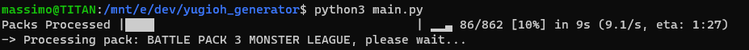
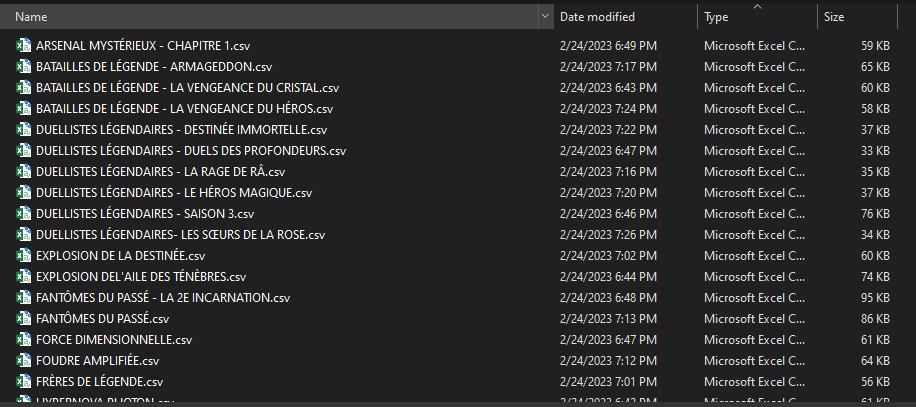

# YUGIOH Database Cardlist Scraper
This is a very simple python script that is used to scrape the KONAMI, yugioh wiki, and yugipedia websites to acquire a complete list of all yugioh cards (and their respective card information) into csv files. This can serve as a great tool for developers interested in the yugioh domain.

## Setup

This script was programmed using `Python 3.8.10`. You can run the `setup.bat` file to create your virtual environment (on windows) and install all dependencies. If not, the repository comes with a `requirements.txt` file that can be used to install all dependencies with your own virtual environment solution on any platform. Installation can be done using the following command.

```
pip install -r requirements.txt
```

## Running



Running the script is as simple as launching the entry point `main.py` specifying the language option (no arguments will default to english).

```
python main.py
```

An output folder will be created with a CSV file for each pack. If a connection is lost, or internet is lost, you can re=run the script and it will continue from where it left off. A picture can be seen below of the output.


A snippet of a single file in excel (delimited using the $ character - this can be modified in the script as needed)
For users using microsoft excel, you can perform the following:
-Navigate to the data tab
-From Text button
-Select one of the csv files generated
-Delimited
-Uncheck Tab and Check Other specifying '$' then next and finish


## Local Database Option
The local database option enables you to leverage a stored local database of data while scraping. This enables to scrape all new cards found and then utilise stored information of previously scraped cards to populate older card information. This is done to reduce the number of requests done on the scraped websites and to speed up the scraping process. If the local database option is not selected, scraping will be performed for all cards (which may be long).

```
python main.py --local_database
```

Once scraping is completed, you can re-run the dataset_creation.py tool to update the currently scraped cards in the json format. I will periodically run this tool to update the json file that is saved inside the repo to, once again, minimize scrapes.

```
python dataset_creation.py
```

## Fast Option
You can skip additional information (passcode, card_supports, card_anti_supports, card_actions, effect_types, status) by enabling the Fast option. This information is retrieved on a secondary website (yugioh wiki) and tertiary website (yugipedia) and can make the scraping significantly longer.

```
python main.py -f
```

## Language Support
language support is an experimental feature that has been added to specify language of output. Languages include English, French, Deutsch, Italian, Spanish, Portuguese, and can be specified as follows:

```
python main.py --language fr # Accepts the following {en,fr,de,it,es,pt,ko,ja}
```


## Bugs
As always, if you find bugs don't hesitate to contact me and I'll do my best to support. Thanks!