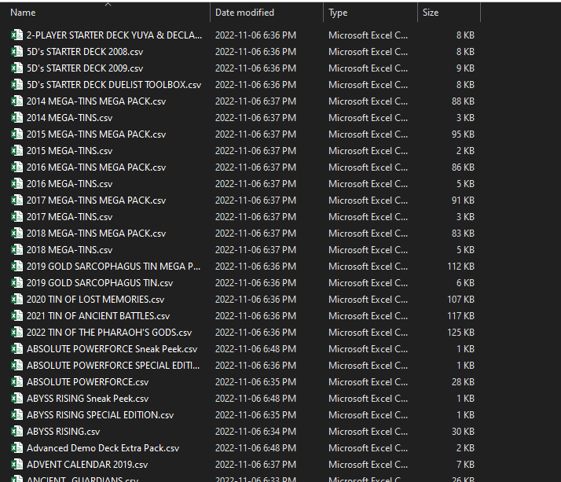
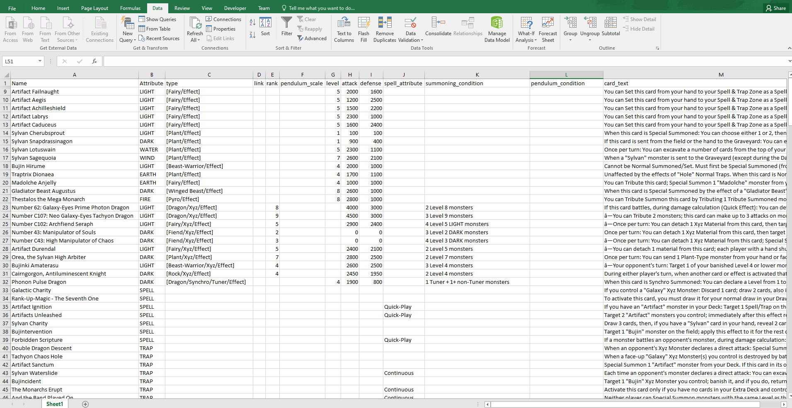

# YUGIOH Cardlist Scraper
This is a very simple python script that is used to scrape the KONAMI website to acquire a complete list of all yugioh cards (and their respective card information) into csv files. This can serve as a great tool for developers interested in the yugioh domain.

## Setup

This script was programmed using `Python 3.7`. The repository comes with a `requirements.txt` file that can be used to install all dependencies. Installation can be done using the following command.

```
pip install -r requirements.txt
```

## Running

Running the script is as simple as launching the entry point `main.py` with no arguments. An output folder will be created with a CSV file for each pack. A picture can be seen below of the output.



A snippet of a single file in excel (delimited using the $ character - this can be modified in the script as needed)

